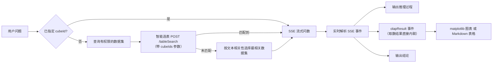
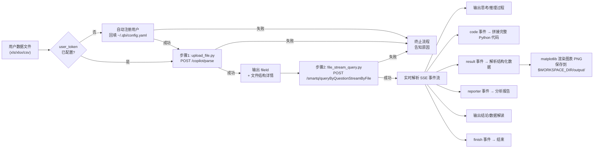

# 问数模块 (Chat Module)

> 配置说明请参见主文件的「配置」章节。

## Scope

**Does:**
- 对 Quick BI 平台已授权数据集进行自然语言查询分析（数据集问数）
- 对用户上传的 Excel/CSV 文件通过 Quick BI API 进行自然语言分析（文件问数）
- 自动智能选表匹配最合适的数据集，无需用户提供 cubeId
- 渲染 matplotlib 图表并输出可视化结果和分析结论

**Does NOT:**
- 在问数场景下使用 pandas/openpyxl/csv 等库直接读取文件进行本地分析
- 要求用户手动提供 cubeId 或其他内部参数

## 技能触发与模式选择

### 模式 A：数据集问数（无文件上传）
- 用户没有上传文件，要查询平台数据集 → **数据集问数**
- 触发词示例："问数""小Q问数""查下xx数据集""数据集提问""自然语言查询"

### 模式 B：文件问数（有文件上传）
- 用户上传了 Excel/CSV 文件并对数据提问 → **文件问数**
- 触发词示例："帮我分析这份数据""查询xx最多的TOP10""各部门销售额对比""分析下这个文件""文件问数"
- **执行方式**：严格按两步脚本执行（upload_file.py → file_stream_query.py），不得用其他方式读取或分析文件

## 前置条件

- 需安装 Python 依赖：`pip install requests pyyaml matplotlib numpy`
- 数据集问数：用户需要有目标数据集的**问数权限**
- 文件问数：文件格式限 `xls`、`xlsx`、`csv`，单文件大小 ≤ 10MB

---

## 模式 A — 数据集问数

对 Quick BI 平台上已授权的数据集进行自然语言查询。

### 工作流程

一步式执行，脚本内部自动完成完整的问数 → 取数 → 渲染流程：



> **等待预期**：问数分析通常需要 15~60 秒，复杂查询可能更久。建议在发起问数前告知用户正在分析中。

### 执行命令

**默认用法（自动智能选表，无需提供 cubeId）**：

```bash
python scripts/chat/smartq_stream_query.py "分析销售数据集中销量最高的地区TOP3"
```

> **cubeId 是可选参数**，脚本会自动查询用户有权限的数据集并通过智能选表匹配最合适的数据集，无需用户手动提供。

可选：已知目标数据集 ID 时直接指定（跳过智能选表）：

```bash
python scripts/chat/smartq_stream_query.py "总销售额是多少" --cube-id "dcbb0f94-4cee-4ba2-9950-927918bdd498"
```

可选：提供候选数据集列表辅助智能选表：

```bash
python scripts/chat/smartq_stream_query.py "总销售额是多少" --cube-ids "cubeId1,cubeId2,cubeId3"
```

### 内部处理流程

1. **智能选表**（当未指定 `--cube-id` 时自动触发）：
   - 调用 `GET /openapi/v2/smartq/query/llmCubeWithThemeList` 查询用户有权限的数据集列表
   - 按用户问题与数据集名称的文本相关性对所有权限数据集预排序
   - 使用**自适应降级策略**调用 `POST /openapi/v2/smartq/tableSearch` 进行智能选表：
     - 依次尝试批次大小 `[30, 10]`（可配置），取当前批次最相关的 top N 个数据集
     - 若接口返回 `"cubeIds can not be empty or over limit"` 错误，自动降级到下一批次
     - 传入参数：`userQuestion`、`userId`、`llmNameForInference`（默认 `SYSTEM_deepseek-r1-0528`）、`cubeIds`
     - 任意批次匹配成功即返回第一个 cubeId，不再继续尝试
   - 若所有批次均未匹配到结果，则按文本相关性从权限数据集中选取最相关的一个

2. **调用问数流式接口**：`POST /openapi/v2/smartq/queryByQuestionStream`，请求体为 JSON（`userQuestion`、`cubeId`、`userId` 等），响应为 SSE 事件流

3. **实时解析 SSE 事件**（事件格式：`event:message\ndata:{"data":"xxx","type":"xxx","subType":"xxx"}`）：
   - `relatedInfo` → 输出关联知识（数据集名称、业务定义等）
   - `reasoning` → 输出推理过程（subType `MODEL_REASONING` 为模型推理）
   - `text` / `sql` → 输出文本和 SQL 语句
   - `olapResult` → **核心步骤**，取数结果直接内联在事件流中
   - `summary` → 输出数据解读（subType `MODEL_REASONING` 为模型推理）
   - `conclusion` → 输出分析结论
   - `check` → 校验错误信息
   - `error` → 异常错误信息
   - `finish` → 问数结束

4. **olapResult 事件处理** ：
   - 从事件 `data` 中解析取数结果 JSON，包含 `values`（行数据）、`chartType`（图表类型枚举）、`metaType`（字段元信息）、`logicSql`（查询 SQL）
   - `metaType` 中 `t` 字段标识维度（dimension）或度量（measure），`type` 字段标识 row/column，多维度场景下 `colorLegend` 标识颜色图例维度
   - `chartType` 枚举：`NEW_TABLE`(交叉表) / `BAR`(柱图) / `LINE`(线图) / `PIE`(饼图) / `SCATTER_NEW`(散点图) / `INDICATOR_CARD`(指标看板) / `RANKING_LIST`(排行榜) / `DETAIL_TABLE`(明细表) / `MAP_COLOR_NEW`(色彩地图) / `PROGRESS_NEW`(进度条) / `FUNNEL_NEW`(漏斗图)
   - 将数据转换为 chart_renderer 格式并使用 matplotlib 渲染图表（输出到 `$WORKSPACE_DIR/output/` 目录）
   - matplotlib 不可用时回退为 Markdown 表格

### 输出说明

脚本运行时会实时输出以下内容：

- `[关联知识]` 命中的数据集和业务定义
- `[推理过程]` AI 的分析推理
- `[SQL]` 生成的查询 SQL
- `[取数结果]` 图表类型和取数状态
- **图表图片或 Markdown 表格**：取决于图表类型和渲染条件（详见下方「展示规则」）
- **`[图表数据]`**：所有图表的结构化数据（含字段信息、数据行、图表类型等）会保存到 JSON 文件，并在控制台输出文件路径
- `[结论]` 最终分析结论
- `[数据解读]` 对数据的进一步解读分析
- `[Trace]` 请求追踪 ID（问题反馈时提供此 ID 可加速排查）
- `[完成]` 问数结束

### 展示规则

> 并非所有问数结果都会生成图表图片。脚本会根据图表类型和渲染条件自动选择输出**图片**或 **Markdown 表格**，Agent 应根据脚本的实际输出格式进行回复。

**何时有图片**：脚本输出中包含 `[...](...)` 时，说明图表已渲染为 PNG。
**何时无图片**：以下场景脚本只输出 Markdown 表格或纯文字结论，不会有 `[...](...)` 图片：
- 图表类型为交叉表（`NEW_TABLE`）或明细表（`DETAIL_TABLE`）→ 直接输出 Markdown 表格
- matplotlib 未安装或渲染失败 → 回退为 Markdown 表格
- 取数结果为空（`values` 无数据）→ 仅输出 `[结论]` 和 `[数据解读]`
- 查询校验失败或出错 → 仅输出 `[校验]` 或 `[错误]` 信息

#### 有图片时（强制）

> **MUST**：脚本输出中包含 `[...](...)` 图片引用时，Agent 的答复中**必须原样包含**该 Markdown 图片语法，否则用户无法看到图表。这是硬性要求，不可省略。

1. **原样复制** `` 到答复正文中，让用户直接看到可视化结果
2. 紧接图片下方标注图表文件路径，例如：`> 图表路径：$WORKSPACE_DIR/output/chart_xxx.png`
3. **不要**在图表上方添加「饼图如下」「脚本输出路径」之类的机械化引导文字，分析结论自然衔接即可
4. 如果有多张图表，按脚本输出顺序逐一内联展示

#### 无图片时

1. 如果脚本输出了 Markdown 表格，**直接展示表格**，结合 `[结论]` 和 `[数据解读]` 进行总结
2. 如果脚本既无图片也无表格（取数为空、查询失败等），基于 `[结论]` / `[错误]` / `[校验]` 信息向用户说明结果
3. **禁止**在没有图片输出时自行编造 `[...](...)` 图片语法或占位表格

**示例 A — 脚本输出包含图片时**：

假设脚本输出中包含：
```

```

Agent 回复应为：
```
根据分析结果，销量最高的三个地区如下：


> 图表路径：/path/output/chart_1744123456_1.png

从图表可以看出，华东地区以 XX 万的销量位居第一……
```

**示例 B — 脚本输出为 Markdown 表格时（无图片）**：

假设脚本输出中包含：
```
[取数结果] 图表类型: table (交叉表), 字段数: 3, 数据行数: 5

| 地区 | 销量 | 占比 |
|------|------|------|
| 华东 | 1200 | 35%  |
| 华南 | 980  | 28%  |
| 华北 | 750  | 22%  |
| 西南 | 320  | 9%   |
| 其他 | 210  | 6%   |

[结论] 华东地区销量最高，占总销量的 35%
[数据解读] 华东和华南两个地区合计占比超过 60%，是主要销售区域……
```

Agent 回复应为：
```
根据数据集的查询结果：

| 地区 | 销量 | 占比 |
|------|------|------|
| 华东 | 1200 | 35%  |
| 华南 | 980  | 28%  |
| 华北 | 750  | 22%  |
| 西南 | 320  | 9%   |
| 其他 | 210  | 6%   |

华东地区销量最高，占总销量的 35%。华东和华南两个地区合计占比超过 60%，是主要销售区域……
```

**示例 C — 取数结果为空或查询失败时**：

假设脚本输出：
```
[取数结果] 查询结果（无数据）
[结论] 未查询到符合条件的数据，建议调整查询条件后重试
```

Agent 回复应为：
```
本次查询未返回数据，可能是筛选条件过于严格或数据集中暂无匹配记录。建议您调整查询条件后重试。
```

---

## 模式 B — 文件问数

基于用户上传的 Excel/CSV 结构化数据文件，通过流式问数接口进行智能分析。

### 工作流程

严格按两步执行，每一步独立运行并输出完整结果。步骤 1 的输出（`fileId`）作为步骤 2 的输入。

**错误处理原则**：业务逻辑错误（权限不足、试用到期、格式不支持等）**必须立即终止整个流程**；网络类瞬态错误（超时、连接中断）可重试 1~2 次（建议指数退避），重试仍失败则终止。



### 步骤 1 — 上传文件获取 fileId

```bash
python scripts/chat/upload_file.py /path/to/data.xlsx
```

| 项目 | 说明 |
|------|------|
| 接口 | `POST /openapi/v2/copilot/parse` |
| Content-Type | `multipart/form-data` |
| 功能 | 上传文件并解析各 Sheet 结构详情 |

#### 请求参数

| 参数 | 类型 | 说明 |
|------|------|------|
| `file` | File | 上传的数据文件（multipart 文件域） |
| `fileName` | String | 文件名（如 `sales_data.xlsx`） |
| `tableConfigs[0].tableName` | String | 表名（默认取文件名去后缀） |
| `tableConfigs[0].tableType` | String | `excel` 或 `csv` |
| `isSave` | String | 固定 `false` |
| `fileId` | String | 留空（首次上传） |

#### 输出内容

脚本会输出：上传进度提示、`fileId`、完整的响应 JSON（含文件结构详情、各 Sheet 的列名和类型）。

> **关键输出**：从输出中提取 `fileId` 值，作为步骤 2 的第一个参数。

#### 错误处理

步骤 1 出现以下任一情况时，**立即终止整个流程，不得继续执行步骤 2**：
- 用户自动注册失败
- 文件上传失败（格式不支持、大小超限、服务端解析错误）
- 脚本以非零退出码结束

> **等待预期**：文件问数通常需要 15~60 秒，复杂分析可能需要数分钟（最长 10 分钟超时）。建议提前告知用户耐心等待。

### 步骤 2 — 基于 fileId 发起流式问数

```bash
python scripts/chat/file_stream_query.py <fileId> "用户的问题"
```

示例：

```bash
python scripts/chat/file_stream_query.py "abc123-def456" "各部门的销售额对比"
```

| 项目 | 说明 |
|------|------|
| 接口 | `POST /openapi/v2/smartq/queryByQuestionStreamByFile` |
| Content-Type | `application/json` |
| 响应格式 | SSE (Server-Sent Events) 事件流 |
| 超时时间 | 10 分钟（600 秒） |

#### SSE 核心事件类型

| 事件类型 | 输出标记 | 处理方式 |
|----------|----------|----------|
| `text` | （直接输出） | 实时拼接输出文本内容 |
| `reasoning` | （直接输出） | 实时输出 AI 思考推理过程 |
| `code` | （静默收集） | 静默拼接 → 流结束后保存到 `$WORKSPACE_DIR/.qbi/smartq-chat/output/` |
| `result` | `[取数结果]` | 解析结构化数据 → matplotlib 渲染图表 PNG |
| `reporter` | （直接输出） | 实时拼接分析报告文本 |
| `html` | `[HTML 图表]` | 仅保存原始 HTML 到 `$WORKSPACE_DIR/.qbi/smartq-chat/output/` |
| `html_result` | `[图表数据]` | 解析结构化数据，渲染图表 |
| `sql` | `[SQL]` | 输出生成的 SQL 语句 |
| `conclusion` | `[结论]` | 输出最终分析结论 |
| `summary` | `[数据解读]` | 输出数据解读分析 |
| `trace` | `[Trace]` | 请求追踪 ID，问题反馈时提供此 ID 可加速排查 |
| `finish` | `[完成]` | 标记事件流结束（终止事件） |
| `error` | `[错误]` | 输出错误信息（终止事件） |

### 展示规则

> 并非所有文件问数结果都会生成图表图片。脚本会根据渲染条件自动选择输出**图片**或 **Markdown 表格**，Agent 应根据脚本的实际输出格式进行回复。

#### 有图片时（强制）

> **MUST**：脚本输出中包含 `[...](...)` 图片引用时，Agent 的答复中**必须原样包含**该 Markdown 图片语法，否则用户无法看到图表。这是硬性要求，不可省略。

1. **原样复制** `` 到答复正文中
2. 紧接图片下方标注图表文件路径
3. **不要**在图表上方添加机械化引导文字
4. 如果有多张图表，按顺序逐一内联展示

#### 无图片时

1. 如果脚本输出了 Markdown 表格，直接展示表格
2. 如果 matplotlib 不可用，基于 `result` 事件数据输出 Markdown 表格
3. 如果既无图片也无表格，基于 `conclusion` / `summary` / `reporter` 内容组织回复
4. **禁止**在没有图片输出时自行编造 `[...](...)` 图片语法或占位表格

### 结果总结要求

Agent 在答复用户时，必须同时满足以下两点：

1. **内联图表（优先）**：若脚本输出中包含 `` 图片引用，**必须先原样复制**到答复正文中（参见上方「展示规则 › 有图片时」），确保用户能看到可视化结果
2. **文字总结**：基于脚本输出中的 `conclusion`（结论）和 `summary`（数据解读）内容，结合 `reporter`（分析报告）文本，对分析结果进行**重新组织和总结**

**禁止**向用户展示分析代码或代码文件路径（详见重要提示第 10 条）。

---

## 异常处理（必读）

脚本已内置以下三种异常的检测逻辑，会在控制台自动打印对应提示。Agent 应参考 `../common/error_messages.md` 中的提示文案向用户传达，可根据上下文适当调整措辞，但核心信息（链接、操作建议）不可省略。检测到任一异常时，**立即终止流程**。

### 1. 无数据集权限

**触发条件**：数据集问数模式下，脚本输出包含「您当前没有可用的问数数据集」
**检测位置**：`scripts/chat/cube_resolver.py` 权限查询
**处理方式**：提示用户没有可用数据集，建议尝试文件问数或开通服务。详细提示文案见 [error_messages.md](../common/error_messages.md)

**附加规则**：整个回复中**只展示一次**，不得重复。可自然询问用户是否改用文件问数。

### 2. 试用到期

**触发条件**：任何步骤的脚本输出或 API 响应中出现错误码 `AE0579100004`
**检测位置**：`scripts/common/utils.py` 中的 `check_trial_expired()`
**处理方式**：告知用户试用已到期，引导开通正式服务。详细提示文案见 [error_messages.md](../common/error_messages.md)

### 3. 数据文件解析失败

**触发条件**：文件问数模式下，脚本输出包含「数据文件解析失败」
**检测位置**：`scripts/chat/file_stream_query.py` 中的 `_on_error` 方法
**处理方式**：提示用户检查文件格式和内容后重试。详细提示文案见 [error_messages.md](../common/error_messages.md)

---

## 关键接口汇总

| 接口 | 方法 | Content-Type | 模式 | 说明 |
|------|------|-------------|------|------|
| `/openapi/v2/smartq/tableSearch` | POST | application/json | A | 智能选表，返回匹配的 cubeId 列表 |
| `/openapi/v2/smartq/query/llmCubeWithThemeList` | GET | - | A | 查询用户有权限的问数数据集列表 |
| `/openapi/v2/smartq/queryByQuestionStream` | POST | application/json | A | 数据集问数流式接口，返回 SSE（olapResult 事件直接包含取数结果） |
| `/openapi/v2/copilot/parse` | POST | multipart/form-data | B | 上传文件并解析结构，返回 fileId |
| `/openapi/v2/smartq/queryByQuestionStreamByFile` | POST | application/json | B | 文件问数流式接口（SSE） |
| `/openapi/v2/organization/user/queryByAccount` | GET | - | 通用 | 通过 accountName 查询用户是否在组织中 |
| `/openapi/v2/organization/user/addSuer` | POST | application/json | 通用 | 添加用户到组织 |

---

## 重要提示

1. **文件问数必须走 API**：详见顶部「核心约束」，禁止使用 pandas/openpyxl 等库直接分析用户上传的文件
2. **模式选择**：根据用户是否上传了文件自动选择数据集问数或文件问数模式
3. **数据集问数无需 cubeId**：用户进行数据集问数时，**直接执行脚本**，不传 `--cube-id`，脚本会自动智能选表。**禁止**要求用户提供 cubeId 或提示 cubeId 为必传参数
4. **文件问数必须分步执行**：先执行步骤 1 上传文件获取 `fileId`，再执行步骤 2 传入 `fileId` 进行问数，不可跳过或合并
5. **错误处理**：业务逻辑错误（权限不足、试用到期等）必须立即终止整个流程；网络类瞬态错误（超时、连接中断）可重试 1~2 次后终止。向用户清晰说明报错原因，并提醒：「如需进一步帮助，请联系 Quick BI 产品服务同学获取支持。」
6. **流式超时**：默认超时 10 分钟（600 秒），复杂查询可能需要较长时间
7. **文件格式限制**：仅支持 `xls`、`xlsx`、`csv` 格式，单文件不超过 10MB
8. **userId 自动处理**：`user_token` 未配置时，脚本启动时即自动基于设备唯一标识生成 accountId，通过组织用户接口检查并注册用户，注册成功后将 userId 回写到全局配置 `~/.qbi/config.yaml`，后续调用不再重复注册
9. **图表展示（强制）**：PNG 文件保存在 `$WORKSPACE_DIR/output/` 目录中，脚本会以 `` 格式输出。Agent **必须**将脚本输出的 `[...](...)` 原样复制到答复中，这是用户看到图表的唯一方式，不可省略
10. **禁止展示代码**：文件问数中 `code` 事件的 Python 代码仅静默保存，**禁止在答复中向用户展示代码内容或代码文件路径**
11. **禁止编造占位表格**：Agent **禁止**自行构造含「(数据见下方图表)」等占位符的 Markdown 表格或其他入空壳表格

---

## Examples

**Example 1: 数据集问数（自动智能选表）**

Input:
```
用户: "销量最高的地区TOP3是哪些"
```

Expected:
```bash
python scripts/chat/smartq_stream_query.py "销量最高的地区TOP3是哪些"
```
脚本自动智能选表匹配数据集，输出推理过程、图表（或 Markdown 表格）和分析结论。

Agent 回复示例（脚本输出含图片时，必须包含图片 Markdown）：
```
根据销售数据集的分析，销量最高的三个地区为：


> 图表路径：/path/output/chart_1744123456_1.png

从图表可以看出：1. XX地区销量最高……
```

**Example 2: 文件问数（上传 Excel 分析）**

Input:
```
用户: 上传了 sales_data.xlsx，提问"各部门的销售额对比"
```

Expected:
```bash
# 步骤 1：上传文件获取 fileId
python scripts/chat/upload_file.py /path/to/sales_data.xlsx
# 输出 fileId=abc123-def456

# 步骤 2：基于 fileId 发起问数
python scripts/chat/file_stream_query.py "abc123-def456" "各部门的销售额对比"
```
分两步执行，Agent 基于结论和数据解读总结分析结果。若脚本输出了 `[...](...)` 图片，**必须原样复制到回复中**；若输出的是 Markdown 表格则直接展示表格；若无图表数据则基于结论文字回复。不展示代码。

**Example 3: 数据集问数（结果为交叉表，无图片）**

Input:
```
用户: "各月份的销售明细数据"
```

Expected:
```bash
python scripts/chat/smartq_stream_query.py "各月份的销售明细数据"
```
脚本输出交叉表类型数据时，直接输出 Markdown 表格而非图片。

Agent 回复示例（无图片时基于表格和结论回复）：
```
以下是各月份的销售明细：

| 月份 | 销售额 | 订单数 |
|------|--------|--------|
| 1月  | 150万  | 320    |
| 2月  | 128万  | 280    |
| 3月  | 175万  | 390    |

从数据来看，3月的销售额和订单数均为最高……
```
